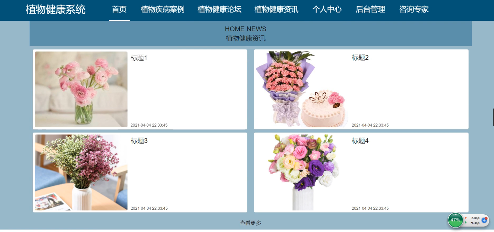
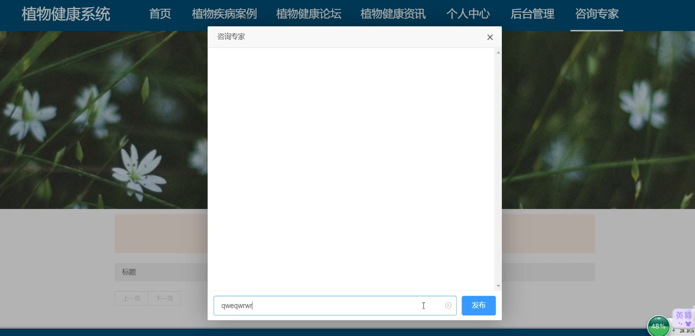
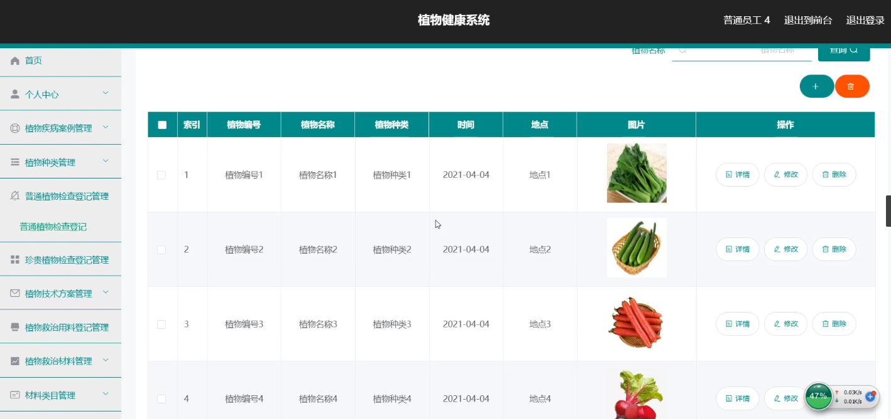
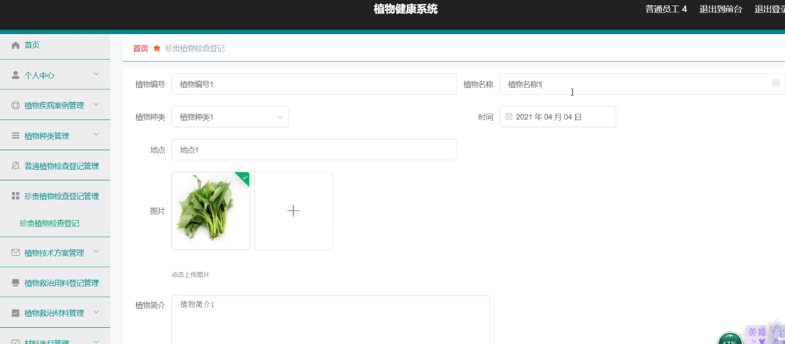
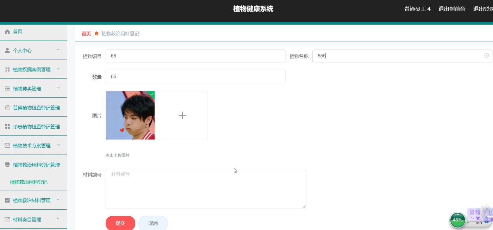
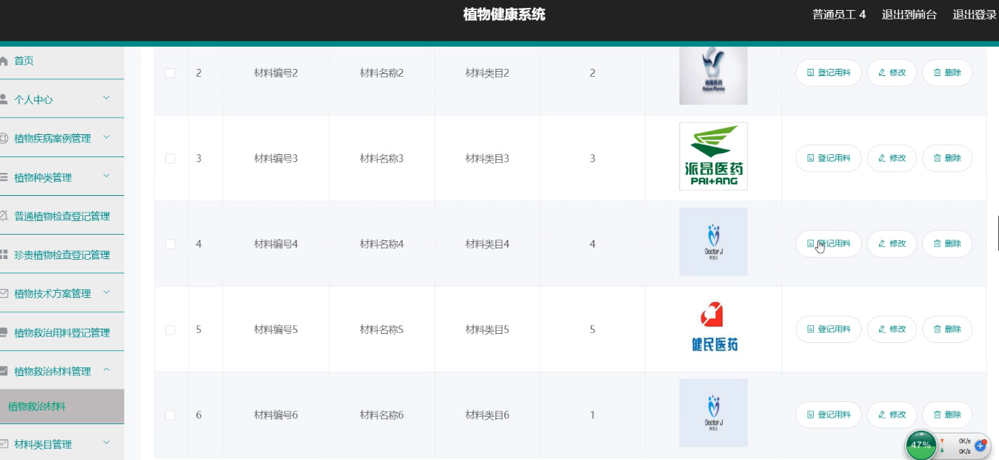
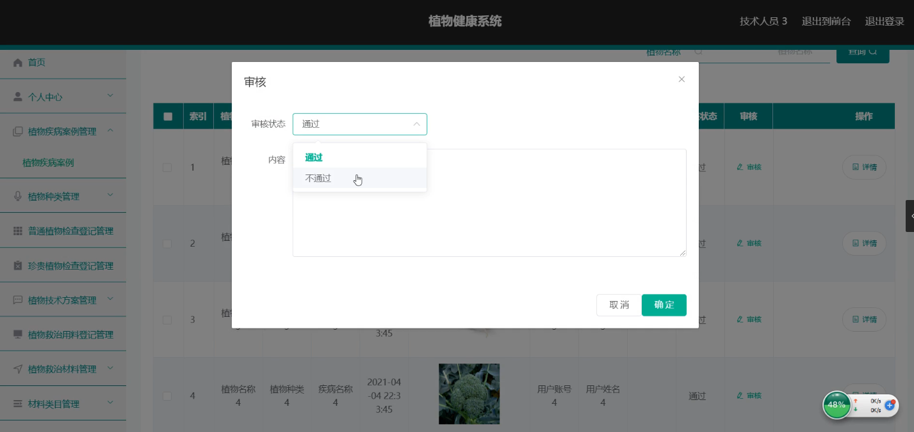

**项目简介：**  
本项目基于主流的前后端分离架构，采用 **SpringBoot + Vue 技术栈**，配套 **MySQL 数据库**，适用于毕业设计与课题实训开发。  
本人已整理了超 **4000 多套毕业设计源码+论文+开题报告+PPT...**，涵盖 **Java、SpringBoot、Vue、SSM、uni-app 小程序、PHP、Android** 等方向，支持功能修改定制与论文服务。  
**团队提供以下服务：**  
- 项目代码修改与调试  
- 数据库配置与远程协助  
- 论文定制与修改  
**获取更多的4000多套源码或SQL文件请联系：**  
- QQ：3906443360 微信：BesheHelp

## springboot087植物健康系统

**项目简介：**  
本项目基于主流的前后端分离架构，采用 **SpringBoot + Vue 技术栈**，配套 **MySQL 数据库**，适用于毕业设计与课题实训开发。  
本人已整理了超 **4000 多套毕业设计源码+论文+开题报告+PPT...**，涵盖 **Java、SpringBoot、Vue、SSM、uni-app 小程序、PHP、Android** 等方向，支持功能修改定制与论文服务。  
**团队提供以下服务：**  
- 项目代码修改与调试  
- 数据库配置与远程协助  
- 论文定制与修改  
**获取更多的4000多套源码或SQL文件请联系：**  
- QQ：3906443360 微信：BesheHelp**

# 系统实现与系统测试

# 概念模式的设计方法是在需求分析的基础上，用概念数据模型（例如E-R模型）表示数据及数据之间的相互联系，设计出反映用户信息需求和处理需求的数据库系统概念模式。概念设计的目标是准确描述应用领域的信息模式，支持用户的各种应用，这样既容易转换为数据库系统逻辑模式，又容易为用户理解。数据库系统概念模式是面向现实世界的数据模型，不能直接用于数据库系统的实现。在此阶段，用户可以参与和评价数据库系统的设计，从而有利于保证数据库系统的设计与用户的需求相吻合。在概念模式的设计中，E-R模型法是最常见的设计方法。本系统的E-R图如下图所示：

（1）管理员信息的实体属性图如下：

图4.12  管理员信息实体属性图

（2）材料类目信息实体属性图如图4.13所示：

图4.13  材料类目信息实体属性图

（3）健康资讯信息实体属性图如图4.14所示：

图4.14 健康资讯信息实体属性图

4.3.2数据库设计表

植物健康系统需要后台数据库，下面介绍数据库中的各个表的详细信息：

表4.1 材料类目

表4.2 咨询专家

表4.3 植物健康论坛

表4.4 技术人员

表4.5 植物健康资讯

表4.6 普通员工

表4.7 普通植物检查登记

表4.8 管理员表

表4.9 珍贵植物检查登记

表4.10 植物疾病案例

表4.11 植物技术方案

表4.12 植物救治材料

表4.13 植物救治用料登记

表4.14 植物种类

5系统详细实现

5.1 系统首页

植物健康系统需要登录才可以看到首页。具体界面的展示如图5.1所示。

图5.1 系统首页界面

5.2 咨询专家

可以在咨询专家栏目发布消息。具体界面如图5.2所示。

图5.2 咨询专家界面

5.3 普通植物检查登记

普通员工可以对普通植物检查登记信息进行添加，修改，删除以及查询操作。界面如下图所示：

图5.3 普通植物检查登记信息管理界面

5.4 珍贵植物检查登记

普通员工可以对珍贵植物检查登记进行添加修改删除操作。界面如下图所示：

图5.4 珍贵植物检查登记界面

5.5 植物救治用料登记

普通员工可以对植物救治用料登记进行添加，修改，删除操作。界面如下图所示：

图5.5 植物救治用料登记信息界面

5.6 植物救治材料管理

普通员工可以对植物救治材料进行添加修改删除操作。界面如下图所示：

图5.6 植物救治材料信息界面

5.7 植物疾病案例管理

技术人员可以对普通员工提交的植物疾病案例进行审核操作。界面如下图所示：

图5.7 植物疾病案例界面

